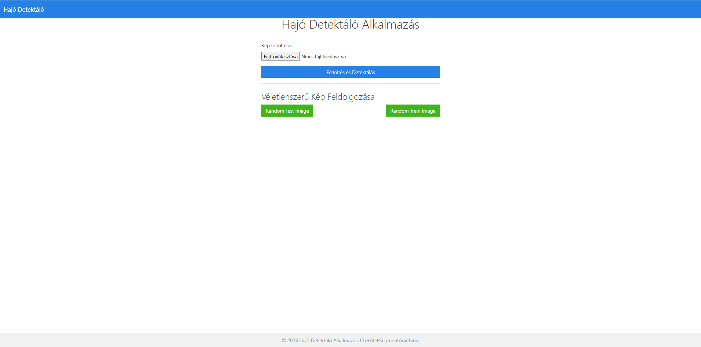
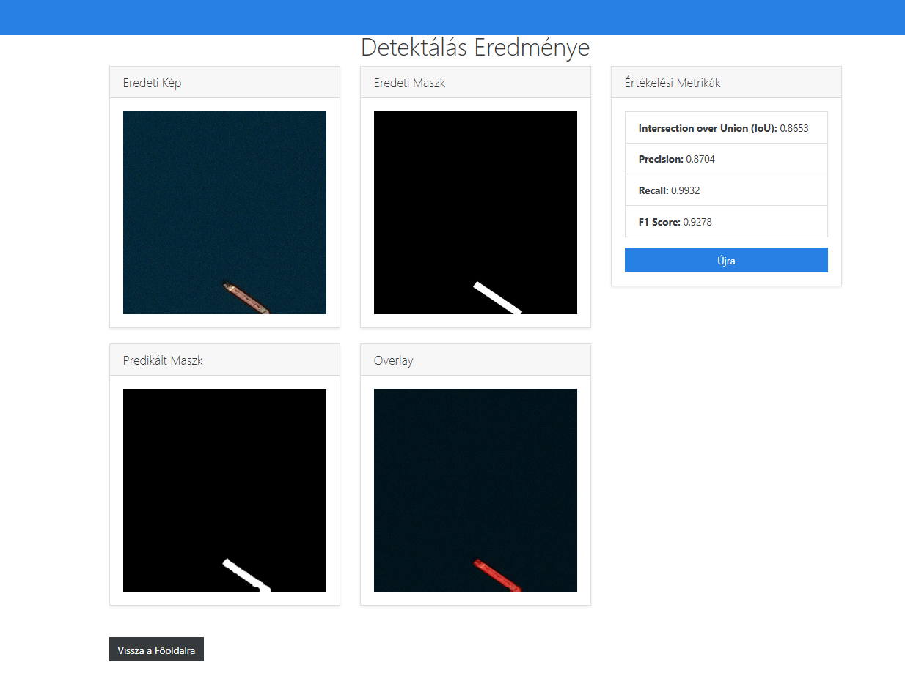

#### Team name: ctr-alt-segmentAnything
#### Members: 

- Hugyecz Sára (n8ersj)
- Somodi István (ixh8ro)
- Géró Kristóf (i0sk1n)

#### Project description:

- https://www.kaggle.com/c/airbus-ship-detection/overview
- "Shipping traffic is growing fast. More ships increase the chances of infractions at sea like environmentally devastating ship accidents, piracy, illegal fishing, drug trafficking, and illegal cargo movement. This has compelled many organizations, from environmental protection agencies to insurance companies and national government authorities, to have a closer watch over the open seas."
- Our goal is to develop a deep learning model that can effectively segment ships in satellite images, accurately identifying their boundaries and locations (if there are any on the image).

### **Milestone 2: Progress Report**

#### **Data Handling**  

To streamline testing and development, we initially worked with a subset of the original dataset. This subset was created using the **`dev_sample.py`** script, which allowed us to efficiently extract a manageable portion of the data for faster iteration. In later phases, we plan to transition to the full dataset for final evaluation.  

- **Total number of images analyzed:** 1,500  
- **Images with ships:** 420  
- **Images without ships:** 1,080  
- **Ratio (ships:no ships):** 0.39  

#### **Model Selection**  

After experimenting with various architectures, we found the **DeepLabV3** model with a **ResNet-50 backbone** to be the most effective for our problem. This model balances segmentation accuracy and computational efficiency, making it a suitable choice for handling satellite imagery.  

To address the significant imbalance between ship and no-ship images, we employed **weighted random sampling** during training. This technique ensures that the model gets a balanced exposure to both classes, improving its performance on minority-class data (ship images).  

#### **Training Details**

- **Loss Function:** Binary Cross Entropy with Logits Loss (**BCEWithLogitsLoss**)  
- **Validation Metric:** Intersection over Union (**IoU**)  
- **Epochs:** 10 (focused on rapid testing and validation)  
- **Early Stopping:** Implemented to halt training if the validation loss does not improve for a set number of epochs. This feature will be especially beneficial when training on the full dataset to prevent overfitting or unnecessary computation.  

Even with a relatively small subset of the data, the model achieved an **IoU of ~75%**, demonstrating its capability to generalize well even with limited training samples.  

#### **Key Observations:**

- If no ships are present in an image, the model confidently predicts no ships, as seen in the evaluation outputs.  
- For images containing ships, the predictions (marked in **red**) are reasonably aligned with the expected masks (**green**). The **yellow** overlay represents the intersection of the two masks.  
- The model often outlines the precise contours of ships, whereas the given masks sometimes use rectangular bounding areas (e.g., ship bows appear blocky in the original mask). This indicates the model's potential for fine-grained segmentation.  

---

#### **How to Run the Code**

**For training:**  
- Navigate to the notebook section **"2. Loading DeeplabV3, training"** and execute the corresponding cells.  

**For evaluation and visualization:**  
- Run the final cell of the notebook: **"visualize_predictions"**.  

This final cell visualizes predicted masks alongside the ground truth, enabling qualitative assessment of the model's performance.  

---
### GUI Description

The project provides a graphical interface to test the trained model for ship detection.

#### How to Start the GUI

**Option 1: Using Docker**  
1. Pull the Docker image:  
   ```
   docker pull ghcr.io/istex9/ship-detector:latest
   ```
2. Run the container:  
   ```
   docker run -p 5001:5001 ghcr.io/istex9/ship-detector:latest
   ```

**Option 2: Locally using Python**  
1. Ensure you have Python 3.9 or above installed.
2. Run the app:  
   ```
   python app.py
   ```

The GUI will be available at `http://localhost:5001` in both cases.

#### Features of the GUI

- **Upload Image:** Allows you to upload a custom image. The model will process the image and display the results, including the original image, predicted mask, overlay, and metrics.
- **Random Test Image:** Fetches a random image from the test set for detection and displays the results.
- **Random Train Image:** Fetches a random image from the training set for detection. In addition to displaying the results, it also shows metrics like Intersection over Union (IoU), Precision, Recall, and F1 Score.

#### Screenshots

Main Interface:  


Detection Results with Metrics:  


---


#### File hierarchy description:
- **test_v2** / **train_v2**: folders containing the images for testing and training
- **train_ship_segmentations_v2.csv**:: csv file containing the image ids and the corresponding ship segmentation masks
- **dev_sample.py**: Script used to create a manageable subset of the data for initial testing and development.  
- **README.md**: this file
- **ship_detection.ipynb**: the main notebook containing the code (from data exploration to model training and evaluation)
